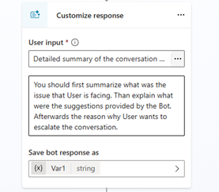
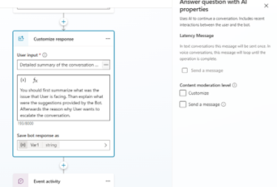
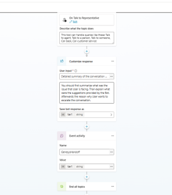
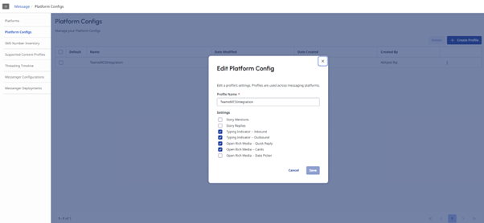
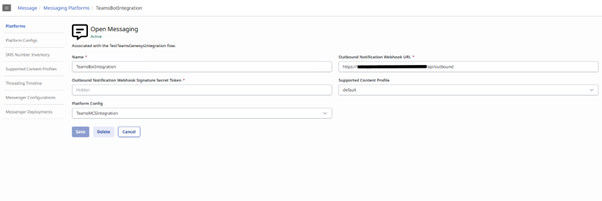
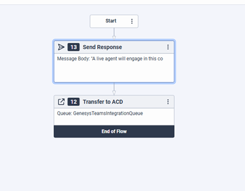
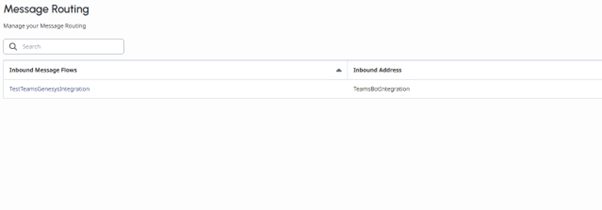

# GenesysHandoff Sample – Comprehensive Setup & Usage Guide

**Repository:** `microsoft/Agents` – `samples/dotnet/GenesysHandoff`

This guide provides step-by-step instructions to configure, deploy, and understand the GenesysHandoff sample, offering detailed guidance and best practices.

---

## Introduction

The **GenesysHandoff** sample demonstrates how a Microsoft Copilot Studio Agent (bot) can seamlessly **hand off a conversation to a live agent** in **Genesys Cloud**. When a user interacting with the bot (e.g., in Microsoft Teams) needs human assistance, the bot will transfer the chat to a Genesys Cloud contact center agent, **preserving the conversation context**.

**Why this is useful:** It combines the efficiency of a bot for common queries with the personal touch of human agents for complex issues. The user stays in the same chat (Teams), and the Genesys agent responds through Genesys Cloud; the GenesysHandoff integration passes messages back and forth behind the scenes.

**Who should use this guide:** Developers who want to run the GenesysHandoff sample. This guide assumes only basic knowledge of bots – it will walk through all required Azure and Genesys setup.

---

## 1. Prerequisites

Before you begin, ensure you have access to the following software and platform credentials:

### Software Requirements

| Item | Requirement |
| :--- | :--- |
| [.NET SDK 8.0](https://dotnet.microsoft.com/en-us/download/dotnet/8.0) | Required for running the sample code. |
| [Dev Tunnels](https://learn.microsoft.com/azure/developer/dev-tunnels/get-started?tabs=windows) | Essential for local development and debugging. |
| [Microsoft 365 Agents Toolkit](https://github.com/OfficeDev/microsoft-365-agents-toolkit) | The SDK used for building the agent. |
| **Visual Studio 2022** (or later) or VS Code with C# extension | For editing and running the project. |
| **Git** | To clone the repository. |
| (Optional) **Azure CLI** | For alternative deployment steps. |
| (Optional) **ngrok** | Alternative tunneling tool if not using Dev Tunnels. |

### Platform Requirements

| Platform | Requirement |
| :--- | :--- |
| [Azure Subscription](https://azure.microsoft.com/en-us/free/) | Required for hosting the agent infrastructure. Free tier suffices for testing. |
| [Microsoft Copilot Studio Platform](https://copilotstudio.microsoft.com) | Access to configure and publish the Copilot. |
| [Genesys Dashboard](https://www.genesys.com) | Access credentials for managing and monitoring Genesys interactions. |
| [Genesys Open Messaging](https://developer.genesys.cloud/commdigital/digital/openmessaging/openmessaging-apis) | Required for setting up messaging flows and configurations. Genesys Open Messaging API v2 is used in this sample. |

### Genesys Cloud Requirements

You will need **admin permissions** in Genesys to:
- Create an Open Messaging integration
- Create an OAuth client (for API access)
- Configure Architect flows
- Access a Genesys **Queue** and a **User (Agent)** who can receive messages (for testing the handoff)

---

## 2. Setting Up the Copilot Studio Agent (Bot)

First, configure your Copilot Studio agent to support escalation. This involves creating an **Escalate topic** that triggers a handoff event, and making sure the bot can be contacted by external systems (Genesys).

### 2.1. Create or Identify an Agent in Copilot Studio

1. **Create an Agent:** Log in to [Microsoft Copilot Studio](https://copilotstudio.microsoft.com), go to **Agents**, and create a new agent (give it a name like "Support Bot with Genesys Handoff"). If using an existing agent, open it for editing.
2. Ensure the agent has the **Teams channel** enabled (since we'll test via Teams). In Copilot Studio's Channels section, add Microsoft Teams if not already added.

### 2.2. Configure the Escalation Topic

Set up the dialog logic so the bot knows when and how to hand off to Genesys. Modify the **"Escalate"** system topic:

1. **Open the Escalate Topic:** In Copilot Studio's Topics list, find the **Escalate** topic (it may be under System Topics).

2. **Trigger Phrases:** Add user phrases that should trigger escalation, such as:
   - `"agent"`
   - `"human help"`
   - `"talk to a person"`
   - `"escalate to human"`

3. **Create a Customize Response Node:**
   - Add a **Customize Response Node** to summarize the conversation for the human agent.
   - 
   - **Save the bot response** into a variable (e.g., `EscalationSummary`). This variable will be passed to Genesys.
   - **Content Moderation Settings:** Uncheck the **"Send a message"** checkbox under **"Content moderation level"** to prevent the node from sending an automatic message to the user.
   - 

4. **Create an Event Node:**
   - Add an **Event Node** and name it **"GenesysHandoff"**.
   - Set its value to the bot response variable created in the previous step (e.g., `EscalationSummary`).
   - 

5. **Verify Topic Flow:** The final structure of your Escalate topic should be:
   - User trigger → (optional confirmation) → **Customize Response (summarize)** → **Event: GenesysHandoff**

### 2.3. Publish the Agent

1. Click **Publish** (usually in the top-right of Copilot Studio).
2. After publishing, test quickly in the Copilot Studio chat canvas: type a phrase like "I want a human." The bot should trigger the event (you may see no response, which indicates the event was triggered).

### 2.4. Retrieve Agent and Environment Metadata

We need two pieces of info from Copilot Studio to configure the integration code:

1. Go to **Settings** > **Advanced** > **Metadata** and record the following:
   - `Schema name`
   - `Environment Id`

2. **Update `appsettings.json` (Copilot Studio Agent):** Set the collected values in the configuration file:

   ```json
   "CopilotStudioAgent": {
     "EnvironmentId": "", // Environment ID of the environment with the CopilotStudio App.
     "SchemaName": ""     // Schema Name of the Copilot to use.
   }
   ```

---

## 3. Setting Up Genesys Cloud (Open Messaging Integration)

Configure Genesys Cloud to handle the incoming chat from the bot and route it to a human agent.

### 3.1. Create an OAuth Client (for Bot API Access)

The bot will use Genesys Cloud's API to start conversations and send messages:

1. In **Genesys Cloud Admin**, navigate to **Admin** > **Integrations** > **OAuth**.
2. Create a **New OAuth Client** with **Client Credentials** grant type.
3. **Permissions:** Assign the **Admin** role (simplest for testing) or specifically add permissions for:
   - `Conversation > Open Messaging > Publish`
   - `Conversation > Open Messaging > Read`
4. After creation, **copy the Client ID and Client Secret** safely.
5. Note the **OAuth Token URL** for your Genesys region (e.g., `https://login.usw2.pure.cloud/oauth/token` for US West).

### 3.2. Configure Platform for Messaging Flow

1. Go to **Admin** > **Message** > **Platform Configs**.
2. Create a new **Platform Config** specific to this flow.
3. 

### 3.3. Configure Open Messaging Integration

1. Go to **Admin** > **Message** > **Platforms**.
2. Create a new **Open Messaging** configuration.
3. **Name:** Give it a name like "Copilot Bot Handoff".
4. **Update the Outbound Notifications Webhook URL** to point to your Azure hosting endpoint (or dev tunnel URL for local testing):
   ```
   https://{{appServiceEndpoint}}/api/outbound
   ```
5. 
6. **Copy the Integration GUID** from the Open Messaging configuration page URL. This GUID is required in the Agent SDK's `appsettings.json`.
7. **Outbound Webhook Secret (Token):** Copy this secret for verifying incoming webhook requests.

### 3.4. Configure Inbound Message Flow (Genesys Architect)

1. Go to **Admin** > **Architect** > **Inbound Messages**.
2. Create a **New Flow** for processing incoming messages.
3. In the flow, use the **"Transfer to ACD"** action.
4. Select the specific **Queue** where escalated messages should be routed to human agents.
5. 
6. Publish the flow.

### 3.5. Configure Message Routing

1. Go to **Admin** > **Routing** > **Message Routing**.
2. Create a **New Message Routing** configuration.
3. Associate it with your **Platform Configuration** (from step 3.2) and the **Inbound Message Flow** (from step 3.4).
4. 

### 3.6. Add Genesys Configurations to Agent SDK

Update the `appsettings.json` file with the details collected from the Genesys setup steps:

```json
"Genesys": {
  "OauthUrl": "https://login.<region>.pure.cloud/oauth/token",
  "ApiUrl": "https://api.<region>.pure.cloud",
  "IntegrationId": "",              // GUID from Open Messaging Integration
  "ClientId": "",                   // OAuth Client ID created in Genesys
  "ClientSecret": "",               // OAuth Client Secret created in Genesys
  "WebhookSignatureSecret": ""      // Optional: outboundNotificationWebhookSignatureSecretToken from Genesys integration
}
```

> **Note:** Replace `<region>` with your Genesys region code (e.g., `usw2` for US-West-2, `use2` for US-East-2).

#### Webhook Signature Validation (Optional but Recommended)

The `WebhookSignatureSecret` setting enables HMAC-SHA256 signature validation for incoming webhook requests from Genesys. When configured:

1. **In Genesys Cloud:** When creating the Open Messaging integration, Genesys generates an `outboundNotificationWebhookSignatureSecretToken`. Copy this value.
2. **In appsettings.json:** Set the `WebhookSignatureSecret` to this token value.

When enabled, the integration will:
- Validate the `X-Hub-Signature-256` header on each incoming webhook request
- Reject requests with invalid or missing signatures (returning a 401 Unauthorized response)
- Use constant-time comparison to prevent timing attacks

> **Security Tip:** It is strongly recommended to configure this setting in production environments to ensure that webhook requests are genuinely from Genesys Cloud and have not been tampered with.

---

## 4. Agent SDK Setup

### 4.1. Create an Azure Bot

Create an Azure Bot using one of the following authentication types:
- [Single Tenant, Client Secret](https://learn.microsoft.com/en-us/microsoft-365/agents-sdk/azure-bot-create-single-secret)
- [Single Tenant, Federated Credentials](https://learn.microsoft.com/en-us/microsoft-365/agents-sdk/azure-bot-create-federated-credentials)
- [User Assigned Managed Identity](https://learn.microsoft.com/en-us/microsoft-365/agents-sdk/azure-bot-create-managed-identity)

> ***Important Note:*** For local development via dev tunnels, only **Client Secret** or **Certificates** are supported.

**Follow the *Next Steps* in the documentation** to configure agent settings after creation.

### 4.2. Set up OAuth for Agent App Registration

Set up OAuth on a **new App Registration** for an exchangeable token:

#### Create a New App Registration

1. In **Azure Portal**, go to **Azure Active Directory** > **App registrations** > **New registration**.
2. Select **Single Tenant**.
3. Give it a name and click **Register**.

#### Configure Authentication

1. Go to the **Authentication** tab.
2. Click **Add Platform**, select **Web**, and set the Redirect URI to:
   ```
   https://token.botframework.com/.auth/web/redirect
   ```
3. Click **Add Platform** again, select **Mobile and desktop applications**, and add:
   ```
   http://localhost
   ```

#### Configure API Permissions

1. Go to the **API Permissions** tab.
2. Add the following permissions:
   - **Dynamics CRM**: `user_impersonation`
   - **Microsoft Graph**: `User.Read`
   - **Power Platform API**: `CopilotStudio.Copilots.Invoke`
3. Click **Grant Admin Consent** for your tenant.

> **TIP:** If you do not see Power Platform API in the list of APIs your organization uses, you need to add the Power Platform API to your tenant. To do that, go to [Power Platform API Authentication](https://learn.microsoft.com/en-us/power-platform/admin/programmability-authentication-v2?tabs=powershell#step-2-configure-api-permissions) and follow the instructions on Step 2 to add the Power Platform Admin API to your Tenant.

#### Expose an API

1. Go to the **Expose an API** tab.
2. Click **Add a Scope**.
3. Set the **Application ID URI** to:
   ```
   api://botid-{{appid}}
   ```
   (Replace `{{appid}}` with your App Registration's Application (client) ID)
4. Configure the scope:
   - **Scope Name**: `defaultScope`
   - **Who can consent**: `Admins and users`
   - Fill in the required **Admin consent display name** and **Admin consent description** fields.
5. Click **Add scope**.

#### Create a Client Secret

1. Go to the **Certificates & secrets** tab.
2. Click **New client secret**.
3. Add a description and select an expiration period.
4. Click **Add** and **record the secret value** - you will need this later.

#### Create Azure Bot OAuth Connection

1. Go to your **Azure Bot** created in section 4.1.
2. Click the **Configuration** tab, then click **Add OAuth Connection Settings**.
3. Configure the connection:
   - **Name**: Enter a name (you will use this in `appsettings.json` as `OAuthConnectionName`).
   - **Service Provider**: Select **Azure Active Directory v2**.
   - **Client ID**: The Application (client) ID from the App Registration created above.
   - **Client Secret**: The secret value created above.
   - **Tenant ID**: Your Azure AD Tenant ID.
   - **Scopes**: `api://botid-{{appid}}/defaultScope` (replace `{{appid}}` with the Client ID from the OAuth App Registration).
4. Click **Save**.

### 4.3. Configure .NET Agent for OAuth

Follow the guide for [configuring your .NET Agent to use OAuth](https://learn.microsoft.com/en-us/microsoft-365/agents-sdk/agent-oauth-configuration-dotnet).

### 4.4. Update Bot Framework Credentials

Update `appsettings.json` with your Azure Bot registration credentials (within the `Connections.ServiceConnection.Settings` section):

```json
"Connections": {
  "ServiceConnection": {
    "Settings": {
      "ClientId": "",      // App ID from Azure Bot registration
      "ClientSecret": ""   // Client secret from Azure Bot registration
    }
  }
}
```

---

## 5. Overview of the GenesysHandoff Integration Code

Understanding how the code works helps with configuration and troubleshooting.

### Key Responsibilities

| Component | Description |
| :--- | :--- |
| **Escalation Event Handler** | Catches the `GenesysHandoff` event from the Copilot agent with the conversation summary. |
| **Genesys API Client** | Uses Genesys Cloud's API to start conversations and send messages on behalf of the user. |
| **Webhook Endpoint** | Receives messages from Genesys agents and relays them back to the user. |
| **Conversation Tracking** | Maintains mapping between bot conversations and Genesys conversations. |

### Project Structure

| File | Purpose |
| :--- | :--- |
| `appsettings.json` | Configuration settings for Azure Bot, Genesys API, and Copilot agent. |
| `Program.cs` | Application startup and dependency injection setup. |
| `GenesysHandoffAgent.cs` | Main agent logic and event handling. |
| `Genesys/` | Genesys API client and related services. |

---

## 6. Running and Testing the Sample

### 6.1. Local Run (Dev Tunnels)

1. **Start the dev tunnel** using the command below, enabling anonymous access:
   ```bash
   devtunnel host -p 3978 --allow-anonymous
   ```

2. In the **Azure Bot** settings, update the **Messaging endpoint** to: `{tunnel-url}/api/messages`

3. Update Genesys Open Messaging **Outbound Webhook URL** to: `{tunnel-url}/api/outbound`

4. Start the Agent in Visual Studio or your IDE (Press F5 or use `dotnet run`).

5. Ensure a Genesys agent is available in the configured queue.

### 6.2. Deployment to Azure

1. **Deploy the code** using Visual Studio publish or Azure CLI:
   - Right-click the project > Publish > Azure > select your App Service > publish.
   - Or use Azure CLI: `az webapp deploy`

2. **Configure settings on Azure:**
   - Ensure all values from your local `appsettings.json` are present as application settings.
   - Double-check that sensitive values (like `ClientSecret`) are set correctly.

3. **Update Bot Messaging Endpoint:**
   - In your Azure Bot registration, set the Messaging endpoint to: `https://<YourAppService>.azurewebsites.net/api/messages`

4. **Update Genesys Webhook URL:**
   - Update the Open Messaging Outbound Webhook URL to: `https://<YourAppService>.azurewebsites.net/api/outbound`

### 6.3. Testing the Agent in Teams or M365

To test your agent in Microsoft Teams or Microsoft 365 Copilot, you need to create and upload a custom app manifest.

#### 6.3.1. Update the manifest.json

1. Navigate to the `/appManifest` folder in the project directory.

2. Edit the `manifest.json` file and make the following replacements:
   - Replace all instances of `${{AAD_APP_CLIENT_ID}}` with your **App ID** (the Azure AD App Registration ID created during Azure Bot setup).
   - Replace `<<BOT_DOMAIN>>` with your Agent URL. For example:
     - For local development: Use your dev tunnel host name (e.g., `abc123.devtunnels.ms`)
     - For Azure deployment: Use your App Service domain (e.g., `youragent.azurewebsites.net`)

3. **Create the manifest package** by zipping the contents of the `/appManifest` folder. The zip file should contain:
   - `manifest.json`
   - `outline.png`
   - `color.png`

   > **Note:** Ensure you zip the *contents* of the folder, not the folder itself. The `manifest.json` should be at the root level of the zip file.

#### 6.3.2. Configure Azure Bot Channels

Before uploading the app, ensure your Azure Bot has the Microsoft Teams channel configured:

1. In the **Azure Portal**, navigate to your Azure Bot resource.
2. Under **Settings**, select **Channels**.
3. If not already added, click **Microsoft Teams** to add the Teams channel.
4. Accept the terms of service and save the configuration.

#### 6.3.3. Upload the Custom App

1. Navigate to the [Microsoft Admin Center (MAC)](https://admin.microsoft.com).
2. Go to **Settings** > **Integrated Apps**.
3. Click **Upload Custom App**.
4. Select the `manifest.zip` file created in the previous step.
5. Follow the prompts to complete the upload and assign the app to users or groups as needed.

After a short period of time (usually a few minutes), the agent will appear in:
- **Microsoft Teams** – Available in the Apps section for chat interactions
- **Microsoft 365 Copilot** – Available as an integrated agent

> **TIP:** If you're testing during development, you can also sideload the app directly in Teams by going to **Apps** > **Manage your apps** > **Upload a custom app** (if your tenant policy allows sideloading).

### 6.4. End-to-End Test

1. **Open Teams** and start a chat with your bot.
2. Say "Hello" to ensure the bot responds normally.
3. **Trigger escalation** by saying "I need a human agent."
4. In **Genesys Cloud**, accept the incoming chat as an agent.
5. As the Genesys agent, send a reply message.
6. **Verify** the reply appears in the Teams chat.
7. Reply from Teams and verify the Genesys agent receives it.

---

## 7. Troubleshooting & Best Practices

### Common Issues

| Issue | Solution |
| :--- | :--- |
| **Bot doesn't hand off** | Verify the Escalation topic is configured correctly and published. Check that trigger phrases match and the event name is "GenesysHandoff". |
| **Genesys not receiving chat** | Check bot logs for API errors. Verify Genesys `IntegrationId`, OAuth credentials, and region URLs are correct. Ensure the Genesys integration is activated (not in draft mode). |
| **Agent messages not reaching user** | Verify webhook URL is correct and accessible. Check for function keys if using Azure Functions. Look for exceptions in Application Insights. Verify conversation reference mapping. |
| **Multiple responses or bot interrupts** | Ensure the bot sets a "handoff active" flag to prevent automated responses during human conversation. Check that the escalation event is the last step in the topic. |
| **Azure deployment issues** | Verify all app settings are configured in Azure. Check that `ClientId` and `ClientSecret` are correct. Use Azure Bot's "Test in Web Chat" to verify connectivity. |

### Best Practices

- **Monitor Genesys Integration:** Use Genesys Cloud admin logs to track message delivery (success/fail).
- **Keep Summaries Concise:** Avoid sending extremely verbose transcripts; summarize key points for the agent.
- **Implement Security:** Verify the `WebhookSecret` on every inbound request from Genesys. Consider restricting Azure function to Genesys IP ranges.
- **Use Persistent Storage:** For production, use Azure Cosmos DB or Azure Storage Tables for conversation mapping to survive restarts.
- **Handle Timeouts:** Consider what happens if the user leaves or the agent doesn't respond.

### Extensions

You can extend this framework to support:
- Sending a **welcome message** when an agent joins
- Logging transcripts for audit purposes
- Multi-language support
- Custom agent routing based on user context

---

## 8. Conclusion

This guide provides a thorough walkthrough to set up the GenesysHandoff sample from scratch. By following the steps to configure Copilot Studio, Genesys Cloud, and the integration code, you should achieve a working end-to-end handoff: a Teams user can escalate to a Genesys live agent, and the agent can chat back via Genesys Cloud, all in real-time.

With the basics in place, you can use this foundation to further integrate and fit your needs (different channels, advanced Genesys workflows, etc.).

---

## Architecture Overview

```
┌─────────────┐     ┌─────────────────────┐     ┌─────────────────┐
│    User     │◄───►│   Bot (Agent SDK)   │◄───►│  Genesys Cloud  │
│  (Teams)    │     │   GenesysHandoff    │     │    (Agent)      │
└─────────────┘     └─────────────────────┘     └─────────────────┘
```

The user communicates through Teams, the Bot (Agent SDK) handles the conversation and escalation logic, and Genesys Cloud manages the human agent interaction. Messages flow bidirectionally through the integration.